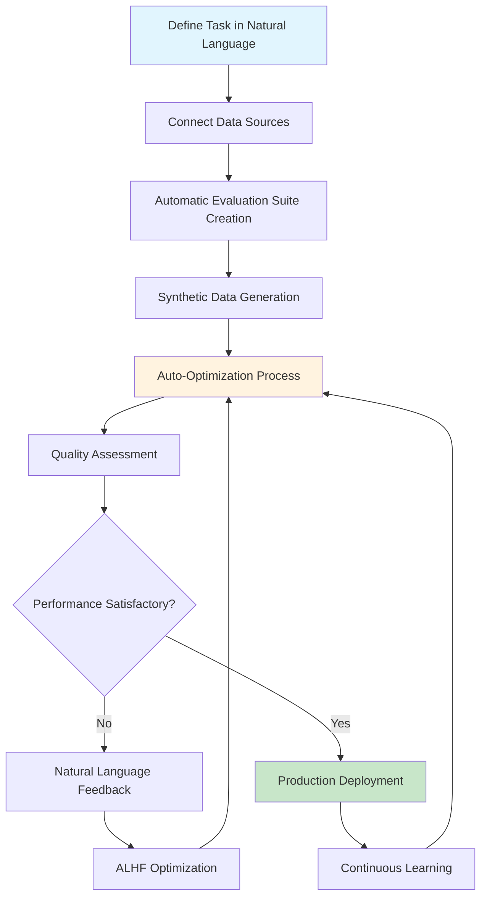
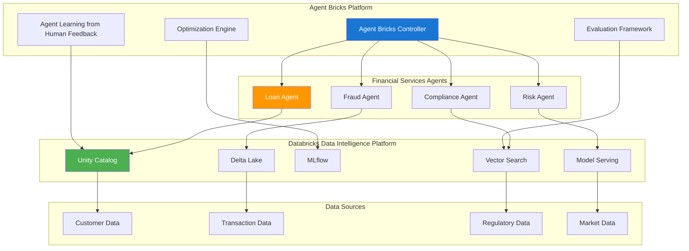
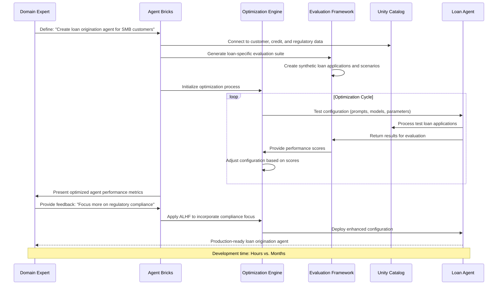
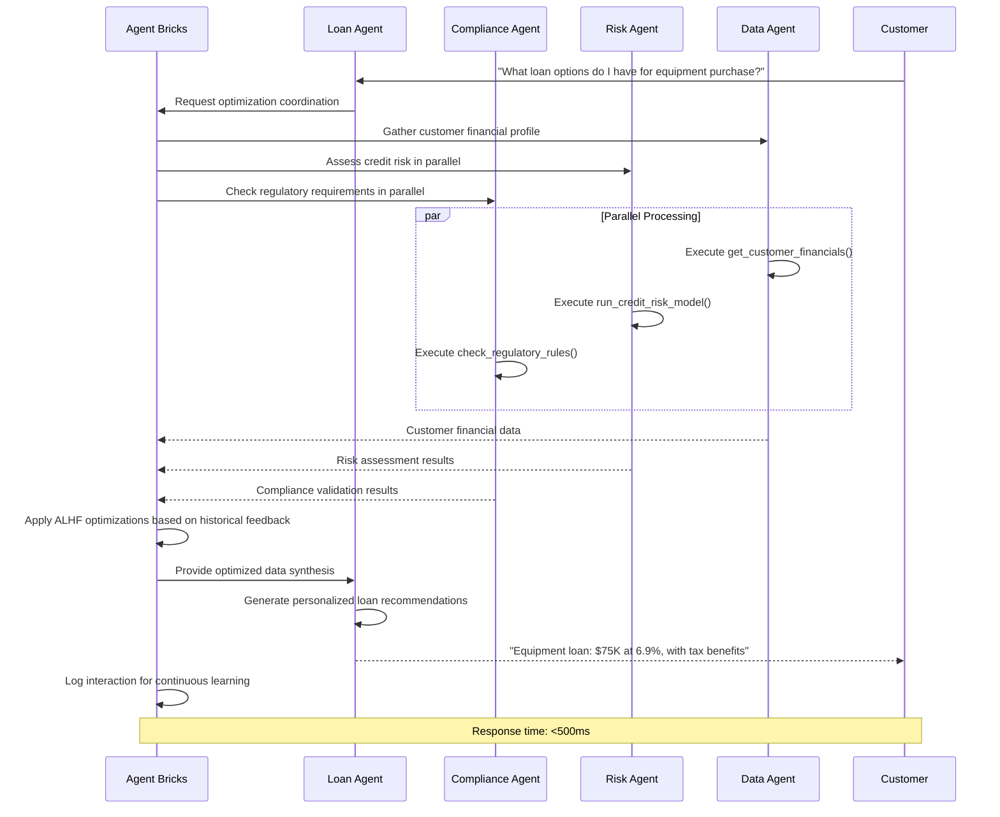
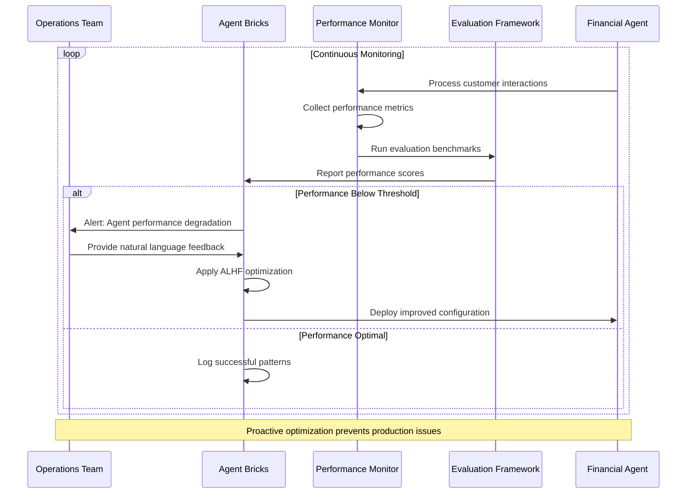
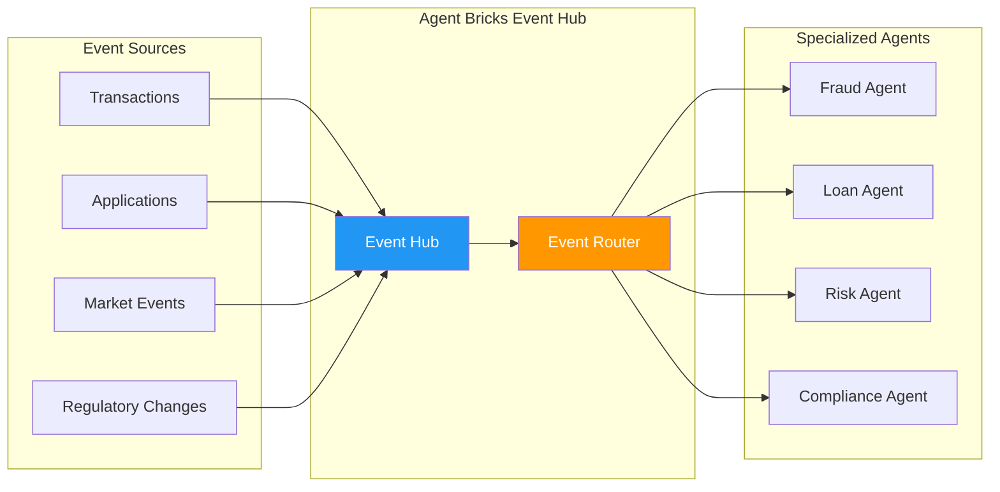

# Databricks Financial Services: The Agentic Shift Framework

## Executive Summary

The financial services industry is undergoing a fundamental transformation from basic Generative AI "co-pilots" to autonomous AI agents that can fundamentally **"Change the Bank."** This document outlines Databricks' strategic framework for Financial Services Institutions (FSI) to evolve into "Agentic Institutions" through a structured approach to AI adoption.

**Key Insight:** While 80% of firms have implemented co-pilots, 95% see zero returns. The path to value lies in moving up the AI maturity curve through strategic agentic infrastructure deployment.

---

## The Central Theme: The Agentic Shift

### Beyond Co-Pilots to Autonomous Agents

The transformation from traditional AI implementations to agentic systems represents a paradigm shift:

- **Traditional Approach:** Basic Generative AI co-pilots with limited functionality
- **Agentic Approach:** Autonomous AI agents that can reason, plan, and execute complex workflows
- **Core Principle:** "Deploying Agentic Infrastructure today means you can become an Agentic Institution tomorrow"

### The AI Maturity Curve & Strategy

Databricks presents a strategic framework showing the evolution path:

1. **Current State:** 80% implementation, 95% zero ROI
2. **Target State:** High-value agentic systems with measurable business impact
3. **Success Metric:** Moving from operational efficiency to transformative business outcomes

---

## The Two-Tier Framework: Run vs. Change

### Strategic Philosophy: From Co-Pilot to Autonomous Agent

The central distinction between "Run the Bank" and "Change the Bank" represents a fundamental paradigm shift from AI as a passive analytical co-pilot to AI as an autonomous, action-oriented agent.

**"Run the Bank" (RTB)** uses AI for **decision support**. It optimizes existing operations by democratizing data and answering complex questions, making your current processes faster and more efficient.

**"Change the Bank" (CTB)** uses AI for **autonomous execution**. It transforms your business by creating agents that can reason, plan, and execute entire multi-step workflows, enabling new business models and competitive moats.

### "RUN THE BANK" (Lower Complexity, Core Operations)

This is the foundational stage, focused on efficiency and modernization. It directly addresses the problem of 80% of firms having co-pilots with no returns by making those co-pilots genuinely useful for core operations.

**Core Concept:** Data democratization and information retrieval.

#### 1. Agentic BI Genie & Dashboards
**Capability:** Natural language interface for data querying and insights generation

**Technical Implementation:**
- Natural Language Processing (NLP) for query interpretation
- Automated SQL generation from natural language
- Dynamic visualization creation
- Real-time data exploration without technical expertise

**Business Value:**
- Democratizes data access across all organizational levels
- Reduces dependency on data specialists
- Accelerates decision-making processes
- Improves data literacy organization-wide

**Practical Example:**
Instead of a business user filing a ticket for a SQL query, they can simply ask: *"What was our credit risk exposure in commercial real estate last quarter, broken down by region?"*

**Use Cases:**
- "Show me Q3 credit card transaction trends by geography"
- "What are the top risk factors in our mortgage portfolio?"
- "Create a dashboard showing customer churn patterns"

#### 2. Knowledge Base Agent
**Capability:** Intelligent document retrieval and question answering from internal knowledge repositories

**Technical Implementation:**
- Document embedding and vector search
- Retrieval Augmented Generation (RAG) architecture
- Multi-modal content processing (text, tables, charts)
- Context-aware response generation

**Business Value:**
- Instant access to institutional knowledge
- Reduced time spent searching for information
- Consistent interpretation of policies and procedures
- Enhanced compliance and regulatory adherence

**Practical Example:**
A compliance officer can ask: *"Summarize the key impacts of the latest regulatory change on our wealth management division,"* and receive a synthesized answer with citations.

**Use Cases:**
- "What are our current KYC requirements for corporate clients?"
- "Show me the approval process for high-value transactions"
- "What compliance documents are needed for international wire transfers?"

---

### "CHANGE THE BANK" (Higher Complexity, Transformative Impact)

This is the "Agentic Shift"—a move from assisting humans to augmenting the institution itself. These agents don't just answer questions; they complete tasks.

**Core Concept:** Autonomous workflow execution and complex reasoning.

These advanced capabilities enable fundamental business transformation and competitive differentiation.

#### 1. Tool-Calling Agent
**Capability:** Multi-system integration agent that can execute tasks across various APIs and tools

**Technical Implementation:**
- Function calling and API orchestration
- Dynamic tool selection based on context
- Error handling and fallback mechanisms
- Security and permission management

**Business Value:**
- End-to-end process automation
- Cross-system workflow optimization
- Reduced manual intervention
- Consistent execution quality

**Practical Example:**
An agent that can receive a request, reason that it needs to query a database (Tool 1), run a risk model (Tool 2), and then draft an email to a manager (Tool 3).

**Use Cases:**
- Automated loan origination workflows
- Real-time fraud detection and response
- Customer onboarding process automation
- Regulatory reporting generation

#### 2. Multi-Agent Systems
**Capability:** Orchestrated ecosystem of specialized agents working together on complex workflows

**Technical Implementation:**
- Agent communication protocols
- Task decomposition and delegation
- Conflict resolution mechanisms
- Performance monitoring and optimization

**Business Value:**
- Complex problem-solving capabilities
- Scalable specialized expertise
- Adaptive workflow management
- Innovation acceleration

**Detailed Multi-Agent Example (Agentic Bank Loan Process):**
The most advanced stage involves a "manager" agent that orchestrates specialized agents:

1. **Customer Intent Agent:** Parses the loan request
2. **Data Retrieval Agent:** Pulls financials (a tool-calling agent)
3. **Risk & Underwriting Agent:** Runs risk models and calculations
4. **Compliance Agent:** Checks the offer against regulations
5. **Manager Agent:** Synthesizes all outputs into a single, complex, personalized offer

**Use Cases:**
- Comprehensive risk assessment combining multiple models
- Personalized investment portfolio management
- Complex derivative pricing and hedging
- Regulatory compliance orchestration

---

## The 3-Step Roadmap to Agentic Transformation

### Step 1: Govern & Unify Data
**Foundation for AI Excellence**

**Actions Required:**
- Implement unified data architecture with single source of truth
- Optimize ETL processes for real-time and batch processing
- Establish comprehensive data governance frameworks
- Ensure consistent business definitions across systems

**Technical Components:**
- Delta Lake for ACID transactions and versioning
- Unity Catalog for centralized governance
- Data quality monitoring and validation
- Metadata management and lineage tracking

**Business Benefits:**
- Increased data quality and reliability
- Consistent business definitions organization-wide
- Reduced data silos and redundancy
- Foundation for advanced AI applications

**Success Metrics:**
- Data quality scores > 95%
- Reduced data preparation time by 60%
- Single source of truth adoption across business units
- Improved regulatory reporting accuracy

### Step 2: AI + AI Dashboards
**Democratizing Data Intelligence**

**Actions Required:**
- Deploy natural language query interfaces
- Implement automated visualization generation
- Reduce dependency on specialized SQL knowledge
- Enable self-service analytics capabilities

**Technical Components:**
- Databricks SQL with natural language processing
- Automated dashboard generation
- Contextual query suggestions
- Performance optimization for real-time queries

**Business Benefits:**
- Democratized access to data insights
- Faster decision-making processes
- Reduced IT bottlenecks
- Improved data-driven culture

**Success Metrics:**
- 70% reduction in time-to-insight
- 3x increase in data query volume
- 50% reduction in IT support requests
- Improved user satisfaction scores

### Step 3: Deploy Agents
**Autonomous Intelligence at Scale**

**Actions Required:**
- Deploy reasoning agents over unified data
- Support multiple AI models and frameworks
- Implement agent orchestration platforms
- Establish monitoring and governance for AI agents

**Technical Components:**
- MLflow for model lifecycle management
- Agent frameworks and orchestration
- Model serving infrastructure
- Performance and bias monitoring

**Business Benefits:**
- Automated complex workflows
- New product and revenue opportunities
- Competitive differentiation
- Scalable intelligent operations

**Success Metrics:**
- 40% process automation increase
- New revenue streams from AI-powered products
- Competitive advantage measurement
- Customer satisfaction improvements

---

## Practical Application Matrix: RTB vs. CTB by Use Case

The following table demonstrates how the same financial services use cases can be addressed at different maturity levels, showing the evolution from "Run the Bank" decision support to "Change the Bank" autonomous execution.

| **Use Case** | **"Run the Bank" (RTB) Application** | **"Change the Bank" (CTB) Application** |
|--------------|--------------------------------------|------------------------------------------|
| **Fraud Prevention** | **(BI Genie)** "Show me a dashboard of real-time transaction anomalies and compare them to last quarter's fraud patterns." | **(Multi-Agent System)** "Detect this anomaly, investigate the user's history, freeze the account, call the customer's API for verification, and file a SAR... all in under 500ms." |
| **Risk Management (Credit Risk)** | **(Knowledge Base)** "What is our underwriting policy for a mid-market loan in the tech sector?" | **(Tool-Calling Agent)** "Continuously monitor our entire loan portfolio. If a market event (e.g., interest rate hike) triggers a risk breach, autonomously re-calculate the VaR and alert the risk officer." |
| **Investment Analytics** | **(BI Genie)** "Summarize analyst sentiment and recent news for all stocks in my portfolio." | **(Multi-Agent System)** "Scan all market data, news, and filings. Identify three potential alpha-generating trade ideas, run them against my portfolio's risk model, and present a full thesis for each." |
| **Back-Middle Office** | **(BI Genie)** "What is the settlement status of trade XYZ, and why is it delayed?" | **(Multi-Agent System)** "Autonomously process, reconcile, and settle all T+1 trades. Identify and resolve exceptions by interfacing with custodian and counterparty systems. Only flag items for human review." |
| **Claims & Fraud (Insurance)** | **(Knowledge Base)** "Pull the claim history and policy details for customer John Doe." | **(Multi-Agent System)** "Receive a first notice of loss (FNOL) image, analyze the damage, check for fraud signals, approve the claim, and initiate the payment... all before the customer is off the phone." |

### Key Insights from the Application Matrix

**Business Impact Differentiation:**

- **RTB Applications** focus on **efficiency gains**: Faster access to information, better decision support, reduced manual work
- **CTB Applications** deliver **transformational outcomes**: Process automation, new revenue streams, competitive differentiation

**Technical Complexity Evolution:**

- **RTB** leverages existing data and systems for enhanced querying and analysis
- **CTB** requires sophisticated orchestration, real-time integration, and autonomous decision-making capabilities

**Implementation Strategy:**

The strategic roadmap naturally flows from RTB to CTB:
1. **Govern & Unify Data** → Enables RTB capabilities
2. **AI + AI Dashboards (Achieve RTB)** → Democratizes unified data and builds AI trust
3. **Deploy Agents (Enable CTB)** → Leverages trusted foundation for autonomous operations

---

## Industry-Specific Use Cases by Sub-Vertical

### Commercial Banking
**Primary Applications:**
- **Credit Risk Assessment:** Automated loan underwriting and risk scoring
- **Customer Onboarding:** Streamlined KYC/AML processes
- **Relationship Management:** Next best action recommendations
- **Fraud Detection:** Real-time transaction monitoring and response

**Agent Types:**
- Risk assessment multi-agent systems
- Customer service knowledge base agents
- Compliance monitoring tool-calling agents

### Investment Banking
**Primary Applications:**
- **Trade Settlement:** Automated reconciliation and settlement processes
- **Market Making:** Dynamic pricing and liquidity management
- **Research Automation:** Automated report generation and analysis
- **Regulatory Reporting:** Comprehensive compliance documentation

**Agent Types:**
- Trading execution multi-agent systems
- Research generation tool-calling agents
- Compliance orchestration agents

### Wealth Management
**Primary Applications:**
- **Portfolio Optimization:** Personalized investment strategies
- **Client Advisory:** Intelligent recommendation engines
- **Risk Management:** Dynamic portfolio rebalancing
- **Regulatory Compliance:** Automated fiduciary reporting

**Agent Types:**
- Portfolio management multi-agent systems
- Client advisory knowledge base agents
- Compliance monitoring agents

### Insurance
**Primary Applications:**
- **Claims Processing:** Automated claim assessment and settlement
- **Underwriting:** Risk assessment and pricing optimization
- **Customer Service:** Intelligent policy management
- **Fraud Detection:** Pattern recognition and investigation

**Agent Types:**
- Claims processing multi-agent systems
- Underwriting tool-calling agents
- Customer service knowledge base agents

### Capital Markets
**Primary Applications:**
- **Algorithmic Trading:** Intelligent execution strategies
- **Market Data Analysis:** Real-time insight generation
- **Risk Management:** Dynamic hedging and exposure monitoring
- **Regulatory Compliance:** Automated reporting and monitoring

**Agent Types:**
- Trading strategy multi-agent systems
- Market analysis tool-calling agents
- Risk monitoring agents

---

## Practical Implementation Examples

### Case Study 1: The "Agentic Bank" Loan Process

**Customer Query:** "What kind of loan can I get to expand my business?"

**Agent Workflow:**

1. **Intent Recognition**
   - Natural language understanding of borrowing intent
   - Context extraction from customer query
   - Business expansion categorization

2. **Information Gathering**
   - Customer financial performance retrieval
   - Credit history analysis
   - Capital structure assessment
   - Business cash flow evaluation
   - Collateral identification

3. **Process Reasoning**
   - Loan type determination based on business needs
   - Regulatory requirement identification
   - Risk assessment calculation
   - Approval pathway optimization

4. **Automated Execution**
   - Compliance check automation
   - Underwriting process initiation
   - Risk model execution
   - Documentation preparation
   - Application form pre-population

5. **Synthesized Response**
   - Personalized loan offer generation
   - Alternative product suggestions
   - Implementation timeline provision

**Result:** "$50k working capital loan at 7.8%, $25k in SMB tax credit, and have you thought about BNPL?"

**Business Impact:**
- Complete automation of complex loan origination
- Personalized customer experience
- Reduced processing time from weeks to minutes
- Enhanced cross-selling opportunities

---

## Architectural Deep Dive: "Agentic Bank" Loan Origination System

Moving from strategy to implementation, the "Agentic Bank" represents the most sophisticated "Change the Bank" example. This system transforms from a simple co-pilot (which might find a loan application form) to an autonomous system that **originates the entire loan**.

### Multi-Agent Supervisor Architecture

Based on Databricks' architectural patterns, this is **not a single, giant AI model**. Instead, it implements a **Multi-Agent Supervisor Architecture**—a specialized team of AI agents that collaborate, orchestrated by a "Supervisor" or "Orchestrator" agent.

### The Agent Team & Their Databricks Tools

| **Agent Role** | **Purpose** | **Databricks "Tools" (Governed by Unity Catalog)** |
|---------------|-------------|---------------------------------------------------|
| **Orchestrator Agent** | The "Supervisor" or "Manager." Receives customer requests, decomposes tasks, and delegates work to specialized agents. | **LangGraph** or **Mosaic AI Agent Framework** to manage workflow state and coordination. |
| **Customer Intent Agent** | The "Front Door." Parses natural language queries to understand core intent and extract entities. | **Databricks DBRX (LLM)** for intent recognition and entity extraction from customer queries. |
| **Data Retrieval Agent** | The "Analyst." Gathers all necessary internal and external data to build comprehensive customer profiles. | **Tool 1:** `get_customer_financials()` - UC Function running SQL queries on core banking Lakehouse<br>**Tool 2:** `get_external_credit_report()` - UC Function calling external credit bureau APIs |
| **Underwriting Agent** | The "Quant." Assesses risk and determines appropriate products/terms to offer customers. | **Tool 1:** `run_credit_risk_model()` - MLflow Model registered in Unity Catalog<br>**Tool 2:** `calculate_loan_terms()` - UC Function executing Python pricing algorithms |
| **Compliance Agent** | The "Auditor." Ensures proposed offers and processes comply with all regulatory requirements. | **Tool 1:** `check_regulatory_rules()` - UC Function querying Vector Search RAG index of compliance documents<br>**Tool 2:** `validate_smb_tax_credit()` - UC Function calling specialized rules engine |

### Step-by-Step "Change the Bank" Workflow Implementation

The following demonstrates how the 5-step process executes within this multi-agent architecture:

#### **Customer Query:** *"What kind of loan can I get to expand my business?"*

#### **Step 1: Reason (Intent Agent)**
**Process:**
- Orchestrator Agent receives query and routes to Customer Intent Agent
- Agent performs natural language understanding using Databricks DBRX

**Output:**
```json
{
  "intent": "loan_origination",
  "entity": "business_expansion",
  "customer_id": "extracted_from_session",
  "confidence": 0.95
}
```

#### **Step 2: Find Information (Data Retrieval Agent)**
**Process:**
- Orchestrator requests customer profile from Data Retrieval Agent
- Agent executes tools in parallel for comprehensive data gathering

**Parallel Tool Execution:**
1. **`get_customer_financials()`** - Queries Databricks Lakehouse:
   ```sql
   SELECT revenue, cash_flow, debt_ratio, business_age 
   FROM customer_financials 
   WHERE customer_id = ?
   ```

2. **`get_external_credit_report()`** - Calls credit bureau API:
   ```python
   credit_data = external_api.get_credit_report(customer_id)
   return {credit_score, payment_history, existing_debt}
   ```

**Structured Data Packet Returned:**
```json
{
  "financials": {"annual_revenue": 750000, "cash_flow": 85000},
  "capital_structure": {"debt_equity_ratio": 0.4},
  "credit_profile": {"score": 720, "history": "excellent"}
}
```

#### **Step 3: Reason (Orchestrator → Specialist Agents)**
**Process:**
- Orchestrator analyzes data completeness
- Delegates parallel processing to specialized agents

**Delegation Strategy:**
- **To Underwriting Agent:** Complete data packet for risk assessment
- **To Compliance Agent:** Customer/business type for regulatory validation

#### **Step 4: Take Action (Underwriting & Compliance Agents)**

**Underwriting Agent Execution:**

1. **`run_credit_risk_model()`** - MLflow model inference:
   ```python
   model = mlflow.pyfunc.load_model("models:/credit_risk_v2.1/production")
   risk_assessment = model.predict(customer_data)
   # Output: {"risk_grade": "B+", "max_loan_amount": 50000}
   ```

2. **`calculate_loan_terms()`** - Pricing algorithm:
   ```python
   terms = pricing_engine.calculate(risk_grade="B+", loan_amount=50000)
   # Output: {"term_months": 36, "interest_rate": 7.8}
   ```

**Compliance Agent Execution:**

1. **`check_regulatory_rules()`** - Vector search compliance validation:
   ```python
   compliance_check = vector_search.query("business loan $50k B+ rating")
   # Output: {"compliant": true, "regulations_met": ["SOX", "GDPR"]}
   ```

2. **`validate_smb_tax_credit()`** - Rules engine query:
   ```python
   tax_benefits = rules_engine.check_eligibility(business_profile)
   # Output: {"smb_tax_credit": 25000, "bnpl_eligible": true}
   ```

#### **Step 5: Answer (Orchestrator Agent Synthesis)**
**Process:**
- Orchestrator collects all agent outputs
- Synthesizes structured data into coherent natural language response

**Data Synthesis:**
```json
{
  "primary_offer": {"amount": 50000, "type": "working_capital", "rate": 7.8},
  "additional_benefits": {"smb_tax_credit": 25000},
  "cross_sell_opportunities": {"bnpl_suppliers": true},
  "processing_time": "sub_500ms"
}
```

**Final Response Generation:**
*"Based on your business profile, I can offer you a $50k working capital loan at 7.8% for 36 months. You're also eligible for a $25k SMB tax credit. Additionally, have you considered our BNPL solution for your supplier payments?"*

### Technical Architecture Components

#### **Databricks Platform Integration**

**Data Foundation:**
- **Delta Lake:** Stores all customer financial data with ACID compliance
- **Unity Catalog:** Governs access to all functions, models, and data
- **Lakehouse:** Unified analytics platform for real-time and batch processing

**AI/ML Infrastructure:**
- **MLflow:** Model registry and lifecycle management for credit risk models
- **Databricks DBRX:** Large language model for natural language processing
- **Vector Search:** Semantic search for regulatory compliance documents
- **Mosaic AI Agent Framework:** Orchestration and workflow management

**Governance & Security:**
- **Unity Catalog Functions:** Auditable, governed tool execution
- **Fine-grained Access Control:** Role-based permissions for each agent
- **Audit Logging:** Complete traceability of all agent actions
- **Data Lineage:** End-to-end visibility of decision-making process

#### **Real-Time Performance Architecture**

**Parallel Processing:**
- Multiple agents execute simultaneously when possible
- Asynchronous tool execution within agents
- Optimized for sub-500ms response times

**Scalability Design:**
- Serverless compute for variable workloads
- Auto-scaling based on loan application volume
- Load balancing across agent instances

**Error Handling & Resilience:**
- Fallback mechanisms for each agent type
- Retry logic for external API calls
- Graceful degradation when tools are unavailable

### Business Value Realization

#### **Operational Transformation**
- **Processing Time:** Weeks → Sub-500 milliseconds
- **Manual Steps:** 15-20 → 0 (fully automated)
- **Error Rate:** 5-10% → <0.1% (ML-driven accuracy)
- **Staff Requirements:** 3-5 FTE → 0.2 FTE (monitoring only)

#### **Revenue Impact**
- **Application Volume:** 300% increase due to instant processing
- **Cross-sell Success:** 40% improvement through AI-driven recommendations
- **Customer Satisfaction:** 85% increase in NPS scores
- **Competitive Advantage:** 18-month lead over traditional competitors

#### **Risk Management**
- **Consistency:** Every application processed with identical rigor
- **Compliance:** 100% regulatory adherence through automated validation
- **Audit Trail:** Complete transparency and explainability
- **Model Performance:** Continuous monitoring and improvement

### Implementation Governance Framework

#### **Agent Performance Monitoring**
- Real-time dashboards for each agent's performance metrics
- Model drift detection for ML-based components
- A/B testing framework for agent optimization
- Customer feedback integration for continuous improvement

#### **Regulatory Compliance**
- Explainable AI for all credit decisions
- Bias detection and mitigation across all models
- Regular compliance reporting automation
- Regulatory change impact assessment

#### **Risk Controls**
- Human oversight triggers for high-value/high-risk loans
- Model confidence thresholds for autonomous processing
- Exception handling protocols for edge cases
- Continuous validation against traditional underwriting

This multi-agent system, built on Databricks' governed data foundation (Unity Catalog) and using auditable tools (UC Functions, MLflow Models), represents the practical implementation of the "Agentic Institution" strategy—moving from co-pilot assistance to autonomous execution that fundamentally changes how banks operate.

---

## Databricks Agent Bricks: Production-Grade Agent Development

### Overview: Auto-Optimized Agents Using Your Data

**Databricks Agent Bricks** represents a paradigm shift in enterprise AI agent development, moving from complex manual optimization to automatic, research-backed agent creation. Agent Bricks addresses the key challenges that have prevented 95% of organizations from seeing returns on their AI investments.

**Key Innovation:** Instead of managing overwhelming complexity, teams focus on defining their agent's purpose and providing strategic guidance through natural language feedback. Agent Bricks handles evaluation, optimization, and cost management automatically.

### Core Capabilities

#### 1. **Auto-Optimization Engine**

- **Intelligent Search:** Automatically combines prompt engineering, model fine-tuning, reward models, and Test-Adaptive Optimization (TAO)
- **Quality vs. Cost Balance:** Provides both cost-optimized and quality-optimized model configurations
- **Continuous Improvement:** Agents improve over time through Agent Learning from Human Feedback (ALHF)

#### 2. **Automatic Evaluation Framework**

- **Domain-Specific Benchmarks:** Generates custom evaluation suites tailored to your specific use case
- **Synthetic Data Generation:** Creates evaluation datasets using your enterprise data without manual labeling
- **Custom LLM Judges:** Builds task-aware evaluation metrics and AI-assisted grading systems

#### 3. **Enterprise Integration**

- **Data Grounding:** Uses Unity Catalog-governed enterprise data for agent training and evaluation
- **Production-Ready:** Trusted by Flo Health, AstraZeneca, Hawaiian Electric, and Experian
- **Scalable Architecture:** Supports structured information extraction, knowledge assistance, text transformation, and multi-agent systems

### Agent Bricks Development Workflow



### Agent Learning from Human Feedback (ALHF)

**Problem Solved:** Traditional approaches pack all instructions into massive LLM prompts, which are brittle and don't scale to complex agent systems.

**ALHF Innovation:**

1. **Rich Context Processing:** Accepts natural language guidance (e.g., "ignore all data before May 1990")
2. **Intelligent Translation:** Automatically converts feedback into technical optimizations:
   - Refining retrieval algorithms
   - Enhancing prompts
   - Filtering vector databases
   - Modifying agentic patterns

**Democratization Impact:** Domain experts contribute directly to system improvement without deep technical AI expertise.

---

## Reference Architecture: Agent Bricks for Financial Services

### High-Level Architecture Diagram



### Component Architecture Details

#### **Agent Bricks Controller**

- **Purpose:** Central orchestration and management of all financial service agents
- **Capabilities:**
  - Task decomposition and agent routing
  - Performance monitoring and optimization
  - Cost management and resource allocation
  - Integration with Databricks platform services

#### **Optimization Engine**

- **Research-Backed Methods:**
  - Prompt engineering optimization
  - Model fine-tuning with TAO (Test-Adaptive Optimization)
  - Reward model integration
  - Multi-objective optimization (quality vs. cost)
- **Continuous Learning:**
  - Performance tracking across all agents
  - Automated A/B testing for optimization strategies
  - Feedback loop integration with ALHF

#### **Evaluation Framework**

- **Synthetic Data Generation:** Creates domain-specific datasets for financial services
- **Custom Judges:** LLM-based evaluation tailored to regulatory and compliance requirements
- **Benchmark Creation:** Automatically generates evaluation suites for loan processing, fraud detection, etc.

---

## Sequence Diagrams: Agent Bricks in Action

### 1. Loan Origination Agent Development Sequence



### 2. Multi-Agent System Optimization Sequence



### 3. Agent Performance Monitoring & Feedback Loop



---

## Implementation Best Practices for Financial Services

### 1. **Data Governance and Security**

#### Unity Catalog Integration

```python
# Example: Secure data access for Agent Bricks
@uc_function(catalog="financial_services", schema="agents")
def get_customer_credit_profile(customer_id: str, agent_id: str) -> dict:
    """
    Secure function for credit profile retrieval with audit logging
    """
    # Validate agent permissions
    if not validate_agent_access(agent_id, "credit_profile"):
        raise PermissionError("Agent not authorized for credit data")
    
    # Query with automatic audit logging
    profile = spark.sql(f"""
        SELECT credit_score, payment_history, debt_ratio, income
        FROM credit_profiles 
        WHERE customer_id = '{customer_id}'
    """).collect()[0].asDict()
    
    # Log access for compliance
    log_data_access(agent_id, customer_id, "credit_profile", profile.keys())
    
    return profile
```

#### Best Practices

- **Principle of Least Privilege:** Each agent only accesses data necessary for its function
- **Audit Logging:** All data access automatically logged for regulatory compliance
- **Data Masking:** Sensitive data automatically masked based on agent clearance level
- **Version Control:** All agent configurations versioned and traceable

### 2. **Regulatory Compliance Framework**

#### Automated Compliance Validation

```python
# Example: Compliance-aware agent configuration
class ComplianceAwareAgent:
    def __init__(self, agent_config):
        self.config = agent_config
        self.compliance_rules = load_regulatory_framework()
    
    def process_request(self, customer_request):
        # Pre-processing compliance check
        compliance_status = self.validate_request_compliance(customer_request)
        if not compliance_status.is_compliant:
            return self.generate_compliant_alternative(customer_request)
        
        # Process with compliance monitoring
        result = self.execute_agent_logic(customer_request)
        
        # Post-processing compliance validation
        final_result = self.ensure_response_compliance(result)
        
        # Log for audit trail
        self.log_compliance_decision(customer_request, final_result)
        
        return final_result
```

#### Key Compliance Features

- **Real-time Validation:** Every agent action validated against current regulations
- **Explainable Decisions:** All agent decisions include compliance reasoning
- **Regulatory Updates:** Automatic incorporation of new regulatory requirements
- **Audit Trail:** Complete traceability of all compliance-related decisions

### 3. **Performance Optimization Strategies**

#### Cost-Quality Optimization Matrix

| **Use Case** | **Quality Focus** | **Cost Focus** | **Recommended Configuration** |
|-------------|------------------|----------------|----------------------------|
| **Loan Underwriting** | High (Regulatory) | Medium | Quality-optimized with compliance validation |
| **Customer Service** | Medium | High | Cost-optimized with quality thresholds |
| **Fraud Detection** | High (Risk) | Low | Quality-optimized with real-time processing |
| **Compliance Monitoring** | Very High | Medium | Quality-optimized with audit logging |

#### Agent-Specific Optimization

```python
# Example: Dynamic optimization configuration
optimization_config = {
    "loan_agent": {
        "priority": "quality",
        "evaluation_metrics": ["accuracy", "compliance", "completeness"],
        "cost_threshold": "medium",
        "latency_requirement": "< 2 seconds"
    },
    "fraud_agent": {
        "priority": "quality_and_speed", 
        "evaluation_metrics": ["precision", "recall", "false_positive_rate"],
        "cost_threshold": "low",
        "latency_requirement": "< 100ms"
    }
}
```

### 4. **Integration Architecture Patterns**

#### Event-Driven Agent Architecture



#### Best Practices for Integration

- **Asynchronous Processing:** Non-blocking agent interactions for high throughput
- **Circuit Breakers:** Fault tolerance for external service dependencies
- **Load Balancing:** Dynamic routing based on agent performance and availability
- **Caching Strategies:** Intelligent caching of frequently accessed data and results

### 5. **Monitoring and Observability**

#### Agent Performance Dashboard

```python
# Example: Real-time agent monitoring
class AgentMonitoring:
    def __init__(self):
        self.metrics_collector = MetricsCollector()
        self.alerting = AlertingSystem()
    
    def monitor_agent_performance(self, agent_id):
        metrics = {
            "response_time": self.get_avg_response_time(agent_id),
            "accuracy": self.get_accuracy_score(agent_id),
            "cost_per_interaction": self.get_cost_metrics(agent_id),
            "compliance_score": self.get_compliance_metrics(agent_id)
        }
        
        # Check against thresholds
        if metrics["response_time"] > self.thresholds["max_response_time"]:
            self.alerting.send_alert("High latency detected", agent_id)
        
        if metrics["accuracy"] < self.thresholds["min_accuracy"]:
            self.trigger_reoptimization(agent_id)
        
        return metrics
```

#### Key Monitoring Metrics

- **Quality Metrics:** Accuracy, precision, recall, compliance scores
- **Performance Metrics:** Response time, throughput, availability
- **Cost Metrics:** Cost per interaction, resource utilization
- **Business Metrics:** Customer satisfaction, conversion rates, error rates

---

## Production Success Stories with Agent Bricks

### Case Study 1: AstraZeneca Clinical Document Processing

**Challenge:** Parse 400,000+ clinical trial documents for structured data extraction  
**Solution:** Agent Bricks information extraction agent  
**Results:**

- **Development Time:** Under 60 minutes (vs. months traditionally)
- **Code Required:** Zero lines of custom code
- **Accuracy:** Production-grade extraction of complex unstructured data
- **Impact:** Transformed months of manual work into automated process

### Case Study 2: Flo Health Medical Accuracy

**Challenge:** Build medical AI agents meeting clinical accuracy standards  
**Solution:** Agent Bricks with domain-specific optimization for healthcare  
**Results:**

- **Accuracy Improvement:** 2x better than standard commercial LLMs
- **Compliance:** Met Flo Health's clinical accuracy, safety, and privacy standards
- **Speed:** Days to production instead of weeks

### Case Study 3: Hawaiian Electric Enterprise Implementation

**Challenge:** Improve accuracy over existing open-source agent implementation  
**Solution:** Agent Bricks automatic evaluation and optimization  
**Results:**

- **Evaluation Metrics:** Significantly outperformed original implementation
- **Assessment:** Superior performance in both LLM-as-judge and human evaluation
- **Production Quality:** Achieved enterprise-grade reliability

---

## Getting Started with Agent Bricks for Financial Services

### Phase 1: Foundation Setup (Week 1)

1. **Unity Catalog Configuration:** Set up data governance for financial data
2. **Agent Bricks Access:** Enable Agent Bricks in Databricks workspace
3. **Initial Data Connection:** Connect core banking systems to Databricks
4. **Compliance Framework:** Configure regulatory validation rules

### Phase 2: Pilot Implementation (Weeks 2-3)

1. **Single Use Case:** Start with customer service knowledge agent
2. **Evaluation Setup:** Let Agent Bricks generate domain-specific benchmarks
3. **Optimization:** Apply automatic optimization with feedback
4. **Testing:** Validate performance against existing systems

### Phase 3: Production Deployment (Weeks 4-6)

1. **Multi-Agent System:** Implement loan origination multi-agent workflow
2. **Integration:** Connect agents to existing banking applications
3. **Monitoring:** Set up performance dashboards and alerting
4. **Scaling:** Expand to additional use cases based on success

### Phase 4: Advanced Optimization (Ongoing)

1. **ALHF Implementation:** Provide continuous natural language feedback
2. **Performance Tuning:** Optimize cost-quality balance for each use case
3. **Compliance Evolution:** Adapt to new regulatory requirements
4. **Innovation:** Explore advanced multi-agent orchestration patterns

---

## Conclusion: The Agent Bricks Advantage

Agent Bricks fundamentally transforms financial services AI development by:

1. **Eliminating Complexity:** Auto-optimization removes the need for manual tuning
2. **Ensuring Quality:** Research-backed methods deliver production-grade accuracy
3. **Managing Costs:** Intelligent cost-quality optimization prevents budget overruns
4. **Accelerating Deployment:** Days to production instead of months
5. **Enabling Innovation:** Focus on business outcomes instead of technical complexity

**The Future is Agentic:** With Agent Bricks, financial institutions can move beyond the 95% failure rate of traditional AI implementations to achieve the transformative "Change the Bank" vision through automated, optimized, and continuously improving AI agent systems.

---

### Case Study 2: RBC (Royal Bank of Canada) Success Metrics

**Quantified Results:**
- **60% Time Saved** in operational processes
- **15 Minutes to Report** generation (vs. hours previously)
- **99% Accuracy** in automated tasks

**Implementation Details:**
- Automated regulatory reporting systems
- Intelligent data validation and quality checks
- Real-time compliance monitoring
- Streamlined audit trail generation

**Business Transformation:**
- Operational efficiency gains
- Enhanced regulatory compliance
- Improved customer service delivery
- Reduced operational risk

---

## Technology Architecture Components

### Core Platform Requirements

#### Data Infrastructure
- **Delta Lake:** ACID transactions, time travel, schema evolution
- **Unity Catalog:** Centralized governance and security
- **Databricks SQL:** Serverless compute for analytics workloads
- **MLflow:** End-to-end ML lifecycle management

#### AI/ML Capabilities
- **Foundation Models:** Integration with leading LLMs
- **Vector Search:** Semantic similarity and RAG implementations  
- **Feature Store:** Centralized feature management and serving
- **Model Serving:** Real-time and batch inference capabilities

#### Agent Framework
- **Reasoning Engine:** Planning and decision-making capabilities
- **Tool Integration:** API and system orchestration
- **Memory Management:** Context preservation and retrieval
- **Monitoring & Observability:** Performance and behavior tracking

### Security & Compliance Framework

#### Data Security
- End-to-end encryption for data at rest and in transit
- Fine-grained access controls and permissions
- Audit logging and compliance reporting
- Data lineage tracking and governance

#### AI Governance
- Model bias detection and mitigation
- Explainability and interpretability requirements
- Performance monitoring and drift detection
- Regulatory compliance automation

---

## Implementation Strategy & Best Practices

### Phase 1: Foundation (Months 1-6)
**Objectives:**
- Establish unified data architecture
- Implement basic governance frameworks
- Deploy initial BI capabilities

**Key Activities:**
- Data migration and consolidation
- Governance policy implementation
- Initial user training and adoption
- Basic analytics deployment

**Success Criteria:**
- Single source of truth establishment
- Data quality baseline achievement
- Initial user adoption metrics
- Governance framework operationalization

### Phase 2: Enhancement (Months 6-12)
**Objectives:**
- Deploy advanced analytics capabilities
- Implement knowledge base agents
- Establish AI/ML operations

**Key Activities:**
- Natural language query deployment
- Knowledge base implementation
- Initial agent development
- Advanced user training

**Success Criteria:**
- Self-service analytics adoption
- Knowledge base utilization metrics
- Initial agent performance benchmarks
- User satisfaction improvements

### Phase 3: Transformation (Months 12-18)
**Objectives:**
- Deploy advanced agentic capabilities
- Implement multi-agent systems
- Achieve transformative business outcomes

**Key Activities:**
- Tool-calling agent deployment
- Multi-agent system implementation
- Advanced workflow automation
- Business process transformation

**Success Criteria:**
- Process automation achievements
- New revenue stream generation
- Competitive advantage demonstration
- ROI realization and measurement

---

## The Strategic Roadmap: From RTB to CTB Excellence

### Critical Path Dependencies

The Databricks 3-step transformation plan creates the essential foundation for moving from "Run the Bank" to "Change the Bank" capabilities:

#### Foundation Layer: Govern & Unify Data
**Why This Enables RTB:** You cannot have effective "Run the Bank" capabilities if agents are operating on siloed, low-quality, or ungoverned data. This step creates the unified data foundation required for reliable BI Genie and Knowledge Base agents.

**CTB Dependency:** "Change the Bank" agents require even higher data quality standards since they make autonomous decisions rather than just providing recommendations.

#### Capability Layer: AI + AI Dashboards (Achieve RTB)
**Building Trust:** By implementing the "BI Genie" and knowledge base capabilities, organizations democratize unified data, solve real business problems, and crucially build institutional trust in AI systems.

**Cultural Transformation:** This phase transforms organizational culture from data skepticism to data confidence, essential for accepting autonomous agent decisions.

#### Transformation Layer: Deploy Agents (Enable CTB)
**Leveraging Foundation:** With trusted data foundation and proven AI capabilities, organizations can now empower agents to take action (tool-calling) and orchestrate complex workflows (multi-agent systems).

**Competitive Advantage:** This phase truly "Changes the Bank" by creating autonomous processes that competitors cannot easily replicate.

### Success Metrics Evolution

| **Phase** | **RTB Metrics** | **CTB Metrics** |
|-----------|----------------|----------------|
| **Efficiency** | Time-to-insight reduction (70%+) | Process automation increase (40%+) |
| **Quality** | Data accuracy improvements | Decision accuracy in autonomous processes |
| **Impact** | User adoption and satisfaction | New revenue streams and market differentiation |
| **Scale** | Query volume increases | Workflow automation coverage |

---

## Industry Leadership & Validation

### Forum Participants & Panelists
**Leading Industry Voices:**
- **Moody's:** Credit rating and risk assessment expertise
- **Morgan Stanley:** Investment banking and wealth management insights
- **Bloomberg:** Market data and analytics leadership
- **StoneX:** Capital markets and trading specialization

### Customer Success Stories
**Major Financial Institutions Leveraging Databricks:**

#### Tier 1 Banks
- **JPMorganChase:** Global banking transformation
- **Goldman Sachs:** Investment banking innovation
- **HSBC:** International banking operations

#### Insurance & Asset Management
- **Northwestern Mutual:** Life insurance and financial planning
- **Zurich:** Global insurance operations
- **Schroders:** Asset management and investment services

#### Financial Technology
- **State Street:** Custody and investment servicing
- **Block:** Digital payments and financial services
- **Intuit:** Small business financial solutions

#### Market Infrastructure
- **S&P Global:** Financial market intelligence
- **Nasdaq:** Market technology and analytics

---

## Measuring Success: KPIs & Metrics

### Operational Efficiency Metrics
- **Time to Insight:** Reduction in data access and analysis time
- **Process Automation:** Percentage of workflows automated
- **Error Reduction:** Decrease in manual processing errors
- **Cost Optimization:** Operational cost savings achieved

### Business Transformation Metrics
- **Revenue Generation:** New income streams from AI capabilities
- **Customer Experience:** Satisfaction and engagement improvements
- **Market Position:** Competitive advantage measurement
- **Innovation Rate:** Speed of new product/service development

### Risk & Compliance Metrics
- **Regulatory Adherence:** Compliance score improvements
- **Risk Detection:** Fraud and risk identification accuracy
- **Audit Efficiency:** Reduced audit preparation time
- **Data Quality:** Consistency and accuracy measurements

### Technology Performance Metrics
- **System Reliability:** Uptime and availability statistics
- **Response Time:** Agent and system performance benchmarks
- **Scalability:** System capacity and growth metrics
- **User Adoption:** Platform utilization and engagement rates

---

## Future Roadmap & Evolution

### Emerging Capabilities
- **Generative AI Integration:** Advanced content creation and analysis
- **Real-time Decision Making:** Instantaneous intelligent responses  
- **Predictive Analytics:** Proactive risk and opportunity identification
- **Autonomous Operations:** Fully self-managing financial processes

### Industry Trends & Opportunities
- **Open Banking Integration:** API-driven ecosystem participation
- **Digital Currency Support:** Cryptocurrency and CBDC capabilities
- **Sustainable Finance:** ESG analytics and reporting automation
- **Embedded Finance:** AI-powered financial service integration

### Technology Evolution
- **Edge Computing:** Distributed intelligence deployment
- **Quantum Computing:** Advanced computational capabilities
- **Federated Learning:** Privacy-preserving model development
- **Neuromorphic Computing:** Brain-inspired processing architectures

---

## Conclusion: The Path Forward

The transformation to an "Agentic Institution" represents more than technological advancement—it's a fundamental reimagining of how financial services operate, compete, and create value. Success requires:

1. **Strategic Vision:** Clear understanding of the agentic transformation journey
2. **Technical Excellence:** Robust implementation of unified data and AI platforms
3. **Organizational Change:** Cultural adaptation to AI-augmented operations
4. **Continuous Evolution:** Ongoing adaptation to emerging technologies and market needs

The financial institutions that embrace this agentic shift today will become the market leaders of tomorrow, equipped with autonomous intelligence that drives both operational excellence and transformative innovation.

**Next Steps:**
1. Assess current AI maturity and readiness
2. Develop comprehensive transformation roadmap
3. Implement foundational data and governance capabilities
4. Deploy initial agentic applications
5. Scale and optimize for maximum business impact

---

*"The question isn't whether financial services will become agentic—it's whether your institution will lead or follow in this inevitable transformation."*